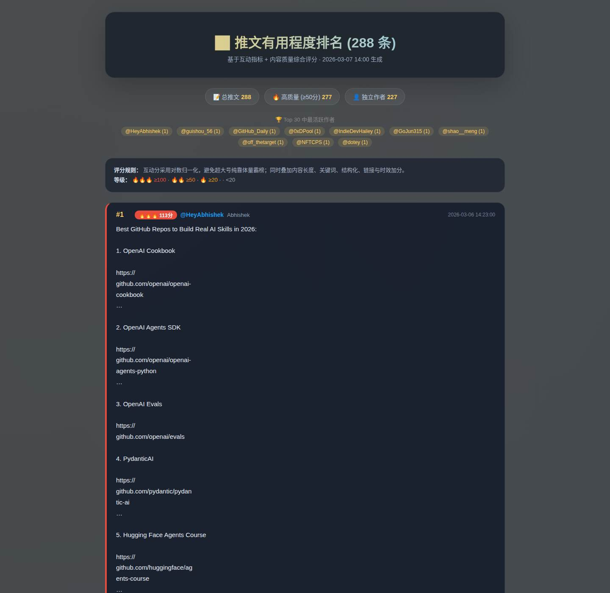
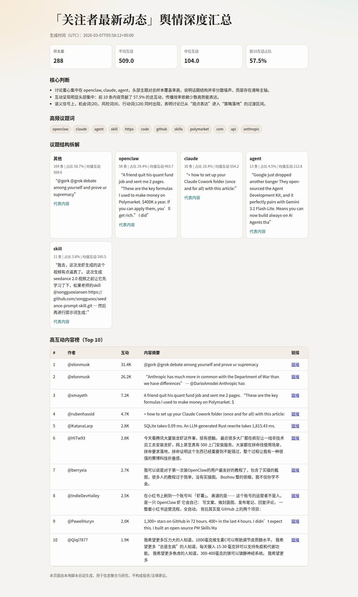
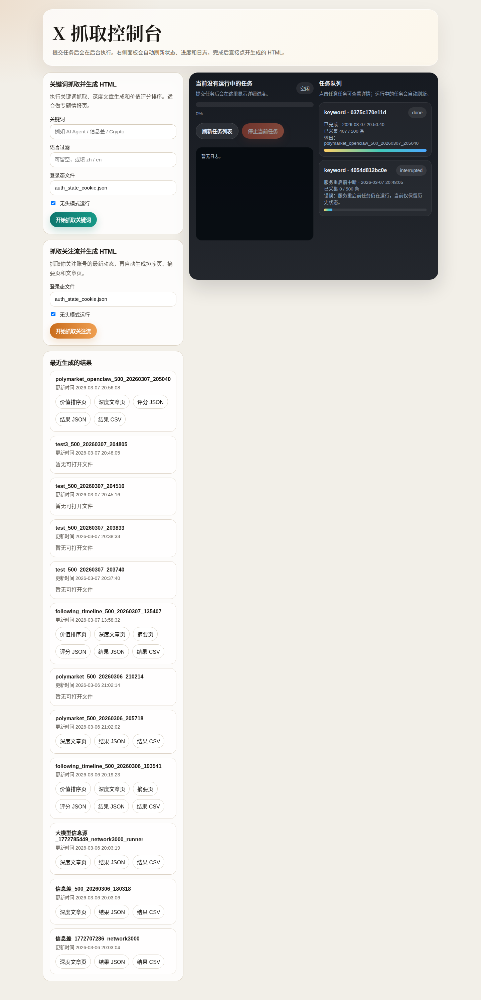
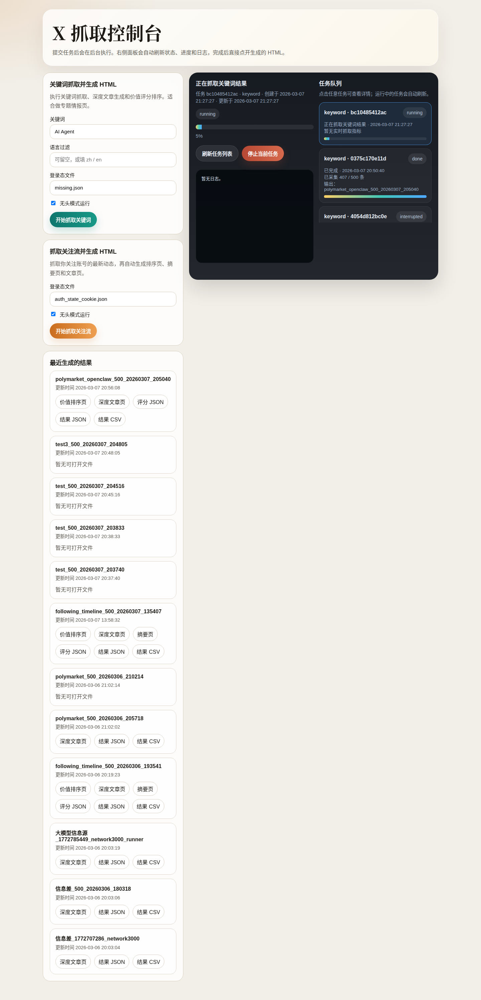

<p align="center">
  
</p>

<h1 align="center">Social Radar</h1>

<p align="center">
  Turn X / Folo / Zhihu / Xiaohongshu into ranked HTML intelligence reports.<br />
  No official API. Local-first. One web console.
</p>

<p align="center">
  
  
  
  
  
</p>

## 中文说明

Social Radar 是一个本地优先的研究与情报工作台，用来把 X / Folo / 知乎 / 小红书 / arXiv 的内容整理成可读、可分享、可继续加工的报告。

当前内置能力包括：

- 按关键词抓取 X，并生成排序页、文章页和中文整理结果
- 按同一个关键词联动抓取 X 与知乎，并生成一个联合总览页
- 抓取关注流、博主历史推文、博主关注列表
- 抓取指定 X 帖子详情页，自动下拉加载并保存原帖与全部评论
- 抓取知乎问题回答、知乎搜索结果、知乎用户动态
- 抓取小红书博主笔记和搜索结果全文
- 抓取 Folo 时间线并生成摘要页
- 从 arXiv 抓取标题严格匹配关键词的论文，PDF 转 Markdown 后立即删除 PDF，并自动生成中文综述草稿
- 在同一个本地控制台里查看任务进度、历史结果，并把生成文件批量发邮件

本地网页控制台 `web_app.py` 当前首页已内置这些入口：

- X 关键词搜索
- X + 知乎联合关键词搜索
- arXiv 标题严格匹配 survey
- X 关注流
- Folo 时间线
- 知乎用户动态
- X 博主历史推文
- X 博主关注列表
- 知乎问题回答
- 知乎搜索前 500 条
- 小红书博主全部笔记
- 小红书搜索前 500 条
- X 指定帖子与评论
- SMTP 邮件批量发送

下面是英文版 README。

## What it does

Social Radar turns noisy public content into something you can actually read and reuse.

- Search X by keyword and export a clean HTML report
- Search the same keyword across X and Zhihu, then generate a combined overview page
- Crawl your following timeline and rank posts by usefulness
- Pull full answers from Zhihu questions or keyword results
- Pull one specific X post plus all loaded comments by scrolling the detail page
- Pull all activities from a Zhihu user profile, including answer/article/pin/video links and full text exports
- Pull Xiaohongshu note lists, full text, images, and comments
- Pull Folo timeline data with your own cookie inside the same web console
- Pull arXiv papers whose titles strictly match your keyword, convert PDFs to Markdown, delete PDFs, and generate a Chinese survey draft
- Track progress in a local web console instead of staring at terminal logs
- Persist tasks locally so history survives page refreshes and service restarts
- Send generated reports as attachments with one-click batch email from the same web console
- Publish generated HTML / CSV / JSON outputs to GitHub with a plain `git add && git commit && git push` workflow
- Highlight the most actionable efficiency posts and the most research-inspiring AI posts
- Explain why each highlighted item matters in Chinese inside the ranking page

This repo is built for people doing:

- content research
- market monitoring
- creator scouting
- lead discovery
- trend validation

## Why people star this kind of repo

It has three traits that travel well on GitHub:

- One-sentence value proposition: "turn social media into ranked reports"
- Visual output: generated HTML pages are screenshot-friendly
- Zero platform API dependency for X: it runs on your logged-in browser session

## Demo

Generated ranking report:


Generated article report:



Web console:



Task progress:



## Quick start

```bash
git clone https://github.com/your-name/social-radar.git
cd social-radar
python3 -m venv .venv
source .venv/bin/activate
pip install -r requirements.txt
python -m playwright install chromium
```

Login to X once:

```bash
python login_x.py --state auth_state.json --timeout 180
```

Start the console:

```bash
python web_app.py
```

Then open:

```bash
http://127.0.0.1:8080
```

## Fastest path to first result

1. Run `python web_app.py`
2. Open the browser console
3. Enter an X keyword, or use the Folo panel
4. Start a `Top 500` search
5. Wait for the report to finish
6. Open the generated HTML output

If your first run does not produce a shareable screenshot in under 10 minutes, the repo is not packaged well enough. That is the standard.

## Core workflows

### 1. X keyword search

```bash
python search_keyword_500.py --keyword "AI Agent" --lang zh
```

Output:

- keyword search results
- full-text hydration
- HTML article page
- usefulness ranking page
- highlighted panels for "efficiency-first" and "AI research inspiration"
- Chinese recommendation reasons for each highlighted post

### 1.5. X + Zhihu combined keyword search

This workflow is currently available from the local web console.

Input:

- one shared keyword
- X auth state
- Zhihu cookie and user-agent

Output:

- one combined output directory
- `combined_overview.html`
- `combined_manifest.json`
- links to the generated X and Zhihu sub-runs

### 2. X following timeline ranking

```bash
python crawl_following_timeline_500.py
```

Output:

- latest following timeline items
- ranked report by usefulness
- HTML summaries for review
- two extra curation blocks for high-efficiency content and AI research inspiration

### 3. Zhihu question answers

```bash
python zhihu_question_answers.py \
  --question-url "https://www.zhihu.com/question/547768388" \
  --cookie "<your cookie>"
```

### 3.5. X 指定帖子与评论

```bash
python crawl_x_post_comments.py \
  --post-url "https://x.com/karpathy/status/2036836816654147718" \
  --state auth_state_cookie.json \
  --cdp-url http://127.0.0.1:9222 \
  --auto-launch
```

输出：

- `post.json`
- `comments.json`
- `comments.csv`
- `summary.md`
- `article.html`

说明：

- 会在帖子详情页持续向下滚动，自动展开更多回复
- 启动后会先等待详情页线程真正加载完成；如果遇到 X 的临时报错页，会尝试点击 `Retry` / 刷新后再继续
- 如果目标主帖没有出现在常规卡片列表里，会从详情页正文和 `og:*` 元信息兜底补全 `post.json`，避免评论已抓到但主帖仍是 `null`
- `comments.csv` 会自动兼容 `full_text`、`full_text_status` 等新增字段，不会因为导出字段扩展而在收尾阶段失败
- `--max-comments 0` 表示尽量抓全当前可加载评论
- 运行中会周期性 checkpoint，任务中断时也能保留已保存结果

### 4. Zhihu keyword top 500

```bash
python zhihu_search_keyword_500.py \
  --keyword "自动驾驶强化学习" \
  --cookie "<your cookie>"
```

### 5. Zhihu user full activity export

```bash
python zhihu_user_activities.py \
  --user-url "https://www.zhihu.com/people/youkaichao" \
  --cookie "<your cookie>"
```

Output:

- `profile.json`
- `activity_links.json`
- `full_contents.json`
- `activities.csv`
- `summary.md`
- `article.html`

Answer extraction now retries transient browser failures such as `ERR_NETWORK_CHANGED`, then falls back to the Zhihu answer detail API so CSV exports keep full answer text instead of leaving blanks.

### 6. Xiaohongshu keyword top 500

```bash
python xiaohongshu_search_keyword_500.py \
  --keyword "AI 副业" \
  --cookie "<your cookie>"
```

### 7. Folo timeline summary

You can run this from the same `http://127.0.0.1:8080` web console.

The new Folo panel supports:

- paste your own Folo cookie
- choose `文章 / 社交 / 图片 / 视频`
- respect the requested display count and paginate `/entries` until it collects enough rows
- generate `summary.html` and `article.html`
- auto-curate:
  - `超级提高效率最优帮助`
  - `对 AI 研究最有启发`
- attach Chinese recommendation reasons to every highlighted item
- translate feed titles, summaries, and common keywords into Chinese for easier review

CLI entry is also available:

```bash
python folo_fetch.py --cookie "<your cookie>" --view 0 --limit 20
```

If you set `--limit 50`, the fetcher now requests more than one page when needed instead of stopping at the API's default first page size.

### 8. arXiv title-matched survey workflow

```bash
python arxiv_title_survey.py "gsm8k" --limit 10
```

Output:

- `papers_md/`: one Markdown file per paper
- `paper_notes/`: normalized reading notes per paper
- `survey.md`: a Chinese survey draft written over the retrieved paper set
- `summary.html`: a browser-friendly index page
- `manifest.json`: retrieval metadata and actual corpus size

Rules:

- every keyword token must appear in the paper title
- PDFs are deleted immediately after Markdown conversion succeeds
- if fewer than 10 papers match, the workflow continues with the actual count instead of failing

## Web console features

The local console in `web_app.py` is the main product surface.

- start tasks from the browser
- run X keyword search and X + Zhihu combined search from the same page
- support direct crawling of a specific X post and its comment thread
- run X user timeline and X following-list crawls without leaving the dashboard
- run Zhihu question, Zhihu search, and Zhihu user activity exports from the same dashboard
- run Xiaohongshu user-note and keyword-search crawls from the same dashboard
- inspect task logs and progress
- reopen historical runs
- auto-select the newest task and recover task details after refresh
- open generated HTML directly
- stop running tasks
- persist task metadata to disk
- run Folo timeline fetches from the same dashboard
- run arXiv title-matched survey generation from the same dashboard
- save SMTP settings locally and send report attachments in bulk with one click

Removed integrations:

- BettaFish-related integration panels and APIs have been removed so the console only exposes the built-in workflows in this repo.

## Ranking page extras

The generated `usefulness_ranking.html` is no longer just a sorted list.

It now also includes:

- `超级提高效率最优帮助`: posts that are most likely to improve workflows, tooling, and execution speed
- `对 AI 研究最有启发`: posts that are most likely to trigger ideas about models, training, evaluation, or agent systems
- Chinese recommendation reasons for every highlighted item so the page is readable without extra prompting

This makes the report more useful as a review surface, not just a dump of high-score posts.

For a repo like this, the console matters more than the crawler scripts. People star products, not script folders.

## Delivery workflows

### One-click batch email

The web console includes a built-in mailer panel.

- configure `SMTP host / port / security / username / password`
- save the config locally to `output/.web_mailer.json`
- pick a generated run directory
- select `summary.html`, `article.html`, CSV, JSON, or other generated files as attachments
- send the report to one or many recipients in one batch

This is useful when you want to deliver the same intelligence pack directly to clients, teammates, or subscribers without leaving the console.

### Push outputs to GitHub

Generated outputs are normal local files, so they can be versioned and published with standard Git commands:

```bash
git add output/
git commit -m "Add latest intelligence reports"
git push origin main
```

Typical use cases:

- push reports to a private GitHub repo for team review
- publish HTML outputs via GitHub Pages
- keep CSV / JSON snapshots under version control for later comparison

## Project structure

```text
.
├── web_app.py
├── login_x.py
├── search_keyword_500.py
├── search_x.py
├── crawl_x_post_comments.py
├── crawl_following_timeline_500.py
├── crawl_user_timeline.py
├── crawl_user_following.py
├── zhihu_question_answers.py
├── zhihu_search_keyword_500.py
├── zhihu_user_activities.py
├── xiaohongshu_search_keyword_500.py
├── xiaohongshu_user_notes.py
├── folo_fetch.py
├── arxiv_title_survey.py
├── rank_usefulness.py
├── html_report.py
└── assets/
```

## Positioning

This is not a general-purpose scraping framework.

This is a local intelligence workbench for turning public social content into:

- readable reports
- ranked opportunities
- reusable research assets

Keeping that positioning narrow is important. Narrow tools spread better.

## Known constraints

- X flows depend on a valid logged-in browser session
- Folo / Zhihu / Xiaohongshu flows require user-provided cookies
- UI and scripts were optimized for practical output, not anti-fragile scraping at massive scale
- Some platform pages will still break when upstream HTML changes

## Security notes

- Do not commit your cookies or auth state files
- Use test accounts where possible
- Review generated reports before sharing externally

## Roadmap

- Better onboarding for first-time login and cookie setup
- Export packaged sample reports for instant preview
- Add source dedupe across platforms
- Add prompt-based ranking profiles like "investor", "operator", "creator"
- Add a one-command demo mode for GitHub visitors

## If you want this to become a real GitHub hit

The code is not enough. You also need distribution.

Ship in this order:

1. Clean repo name: `social-radar`
2. Short demo video: 30-45 seconds
3. Tweet: "I built a local app that turns X into ranked HTML reports"
4. Post screenshots before code snippets
5. Keep README above the fold brutally simple

That is how projects like this get their first 100 stars.
